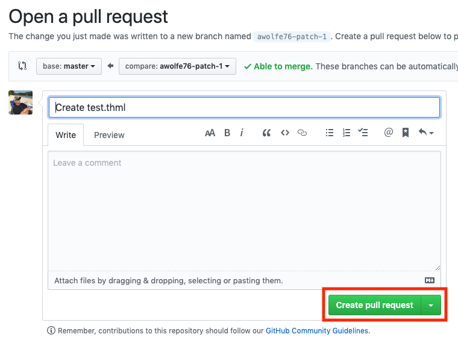

# Adding a new client file

1. Follow [this link to the `template.html` file](template.html).
1. Click the "Raw" button.
   
1. Copy (COMMAND+C or CTRL+C) all the contents.
1. Click the back button.
1. [Go to the `rdof` directory](./rdof).
1. Click the "Create new file" button.
   
1. Enter the name of your file. This will always be formatted the same, you only ever need to change the coop name, e.g. `rdof_coast.html`.
   
1. Paste (COMMAND+V or CTRL+V) the raw contents of the file into the file editor.
   
1. Create a pull request. You can add a message and description if you want, and even change branch name, but it's not necessary. Click the "Propse new file" button.
   
1. Click the "Create pull request button"
   
1. Your PR is ready for review and merging.
1. After that it will be live at `https://conexon.github.io/coop/rdof/<filename>.html`.
